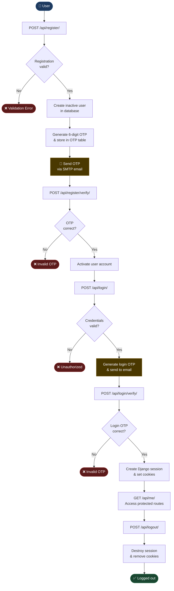

<div align="center">

# 🔐 SecureAuth — Django OTP Authentication API

**A production-ready authentication system built with Django REST Framework**  
*Session-based auth · OTP verification · CSRF protection · Swagger docs*


</div>

---

## 📋 Table of Contents

- [Overview](#-overview)
- [Authentication Flow](#-authentication-flow)
- [Features](#-features)
- [Tech Stack](#-tech-stack)
- [Project Structure](#-project-structure)
- [Getting Started](#-getting-started)
- [API Reference](#-api-reference)
- [Security](#-security)
- [Testing](#-testing)
- [Roadmap](#-roadmap)
- [Author](#-author)

---

## 🧭 Overview

SecureAuth is a secure, session-based user authentication REST API built with Django and Django REST Framework. It implements a full OTP (One-Time Password) verification flow — users register, verify their email with a 6-digit OTP, and then authenticate using session cookies. No JWT tokens are used; security is enforced through Django's built-in CSRF and session middleware.

---

## 🔄 Authentication Flow



---

## ✨ Features

| Feature | Description |
|---|---|
| 🔑 User Registration | Create accounts with username, email, and password |
| 📧 OTP Verification | 6-digit OTP sent to email for account activation |
| 🔐 Login with OTP | Two-factor login flow using email OTP |
| 🍪 Session Authentication | Secure cookie-based sessions via Django |
| 🛡️ CSRF Protection | Built-in Django CSRF middleware enabled |
| 👤 Protected Endpoints | `/me/` route requires active session |
| 🚪 Logout | Full session destruction and cookie cleanup |
| 📄 Swagger Docs | Interactive API documentation via drf-yasg |

---

## 🛠️ Tech Stack

| Layer | Technology |
|---|---|
| Language | Python 3.10+ |
| Framework | Django 4.x |
| REST API | Django REST Framework (DRF) |
| API Docs | drf-yasg (Swagger / ReDoc) |
| Database | SQLite3 |
| Email | SMTP (Gmail) |
| Auth | Django Session Authentication |

---

## 📁 Project Structure

```
django-auth-system/
│
├── authentication/
│   ├── migrations/          # Database migrations
│   ├── models.py            # User & OTP models
│   ├── serializers.py       # Registration serializer
│   ├── verify_serializer.py # OTP verification serializer
│   ├── login_serializer.py  # Login serializer
│   ├── views.py             # API view logic
│   └── urls.py              # App-level URL routing
│
├── backend/
│   ├── settings.py          # Django project settings
│   └── urls.py              # Root URL configuration
│
├── requirements.txt         # Python dependencies
├── manage.py                # Django CLI entry point
└── README.md
```

---

## 🚀 Getting Started

### Prerequisites

- Python 3.10+
- pip
- Git

### 1. Clone the repository

```bash
git clone <your-github-repository-link>
cd django-auth-system
```

### 2. Create and activate a virtual environment

```bash
# Create
python -m venv venv

# Activate — Windows
venv\Scripts\activate

# Activate — macOS / Linux
source venv/bin/activate
```

### 3. Install dependencies

```bash
pip install -r requirements.txt
```

### 4. Apply database migrations

```bash
python manage.py makemigrations
python manage.py migrate
```

### 5. Start the development server

```bash
python manage.py runserver
```

The server will be available at `http://127.0.0.1:8000/`

### 6. Open Swagger UI

```
http://127.0.0.1:8000/swagger/
```

---

## 📡 API Reference

### Register User

```http
POST /api/register/
```

**Request body:**
```json
{
  "username": "bhargav",
  "email": "bhargav@test.com",
  "password": "123456"
}
```

**Response:**
```json
{
  "message": "OTP sent successfully"
}
```

---

### Verify Registration OTP

```http
POST /api/register/verify/
```

**Request body:**
```json
{
  "email": "bhargav@test.com",
  "otp": "123456"
}
```

**Response:**
```json
{
  "message": "OTP verified successfully"
}
```

---

### Login

```http
POST /api/login/
```

**Request body:**
```json
{
  "username": "bhargav",
  "password": "123456"
}
```

**Response:**
```json
{
  "message": "Login OTP sent"
}
```

---

### Get Current User *(Protected)*

```http
GET /api/me/
```

> Requires an active session cookie.

**Response:**
```json
{
  "id": 1,
  "username": "bhargav",
  "email": "bhargav@test.com"
}
```

---

### Logout

```http
POST /api/logout/
```

**Response:**
```json
{
  "message": "Logged out successfully"
}
```

---

## 🛡️ Security

This project implements multiple layers of security:

- **CSRF Protection** — Django's CSRF middleware is enabled across all endpoints
- **Session Authentication** — Uses `sessionid` and `csrftoken` cookies; no JWT tokens
- **HttpOnly Cookies** — Prevents JavaScript access to session cookies
- **SameSite Cookie Policy** — Mitigates cross-site request attacks
- **IsAuthenticated Permission** — Protected routes require a valid, active session
- **Inactive User Accounts** — Accounts are only activated after OTP verification

---

## 🧪 Testing

The API can be tested using:

- **Swagger UI** — `http://127.0.0.1:8000/swagger/` — interactive browser-based testing
- **Django Session Auth** — authenticate via the session cookie
- **Browser Developer Tools** — inspect cookies (`sessionid`, `csrftoken`)

---

## 🗺️ Roadmap

- [ ] Real SMTP email delivery with OTP
- [ ] OTP expiry (time-based invalidation)
- [ ] Password reset flow
- [ ] Rate limiting on auth endpoints
- [ ] Docker containerization
- [ ] PostgreSQL support
- [ ] Token-based auth option (JWT)

---

## 👨‍💻 Author

**Bhargav Ram**

> Built for technical assessment and educational purposes.

---

<div align="center">

*Made with Django 

</div>